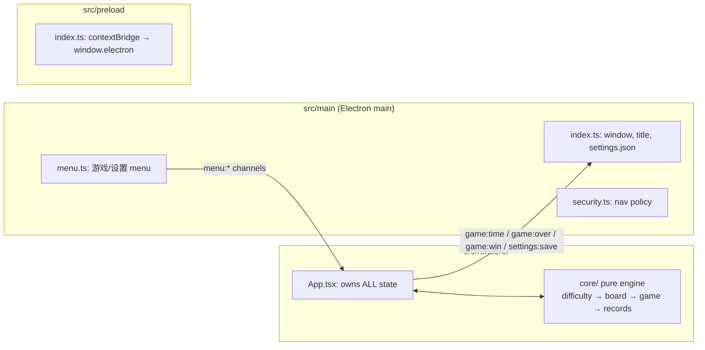

# Repository Guidelines

## Project Overview

Modern Minesweeper desktop app ("扫雷") built with Electron + React 19 + TypeScript, bundled by electron-vite, packaged by electron-builder. UI text, menu labels, and code comments are largely in Chinese. Single-window app; no backend — all state is in-memory or `localStorage`.

## Architecture & Data Flow

Three Electron build targets (see `electron.vite.config.ts`), all TypeScript:



- **Unidirectional game flow**: `difficulty.ts` normalizes config → `board.ts` creates board/places mines → `game.ts` applies rules per action → `records.ts` persists best times to `localStorage`.
- **State management**: no context/reducer/state library. All state lives in `App.tsx` as `useState<GameState>` etc. Core functions **mutate a `GameState` in place and return `void`**; the React layer does `structuredClone(game)` → mutate via core → `setGame(next)` to re-render. Never mutate the state you rendered.
- **IPC contract**: preload exposes the full `@electron-toolkit/preload` `electronAPI` as `window.electron` — **no channel whitelist, so new IPC channels need zero preload changes**. Channel naming is `"<domain>:<kebab-event>"`:
  - main → renderer: `webContents.send('menu:*', …)` (9 channels, subscribed in `App.tsx` `useEffect` with `removeListener` cleanup)
  - renderer → main: fire-and-forget `ipcRenderer.send` / `ipcMain.on` (`game:time`, `game:over`, `game:win`, `settings:save`); request/response `invoke`/`ipcMain.handle` only for `settings:load` (registered but currently unused)
- **Theming**: CSS custom properties on `:root[data-theme='dark|light']` and `:root[data-skin='classic|modern']` in `index.css`; applied by `applyTheme`/`applySkin` in `theme.ts`, persisted to `localStorage` (`minesweeper-theme`/`minesweeper-skin`) plus IPC `settings:save` (main only uses it for startup window background).

## Key Directories

| Path | Purpose |
|---|---|
| `src/main/` | Electron main: `index.ts` (window, IPC, title/timer flash), `menu.ts` (app menu), `security.ts` (navigation lockdown, side-effect import) |
| `src/preload/` | `index.ts` (contextBridge), `index.d.ts` (global `Window.electron` typing) |
| `src/renderer/src/core/` | Framework-free game engine: `types.ts`, `difficulty.ts`, `board.ts`, `game.ts`, `records.ts` |
| `src/renderer/src/components/` | `HeaderBar`, `Board`, `CellButton`, `DifficultyPicker`, `ThemeSkinPicker` |
| `src/renderer/src/` | `App.tsx` (root, all state), `theme.ts`, `index.css`, `main.tsx`, `env.d.ts` |
| `src/renderer/src/core/__tests__/` | Vitest tests for core only |
| `out/` | electron-vite build output (gitignored); `dist/` electron-builder artifacts; `build/` app icon |

## Development Commands

```bash
npm run dev          # electron-vite dev (main/preload/renderer HMR)
npm test             # vitest run
npm run typecheck    # tsc --noEmit on node + web tsconfigs (run before committing)
npm run build        # typecheck + electron-vite build → out/
npm start            # electron-vite preview (built output)
npm run build:win    # build + electron-builder --win (also :mac / :linux)
```

## Code Conventions & Common Patterns

- **TypeScript**: strict base via `@electron-toolkit/tsconfig` — `strict`, `noUnusedLocals`, `noUnusedParameters`, `noImplicitReturns` (but `noImplicitAny: false`). Typecheck is the lint gate; there is **no ESLint/Prettier/editorconfig** — match surrounding style manually (single quotes, no semicolons, 2-space indent).
- **Core engine rules** (invariants when editing game logic):
  - `createGame()` calls `resolveCustomConfig()` on **every** incoming config — the single choke point guaranteeing `mines ≤ rows*cols − SAFE_ZONE` (`SAFE_ZONE = 9`, first-click 3×3 safe zone). Keep this guarantee if you add config sources.
  - Every game action (`revealCell`, `toggleFlag`, `chord`) returns early when `status === 'won' | 'lost'`.
  - First click is always safe: `placeMines` runs on the first `revealCell` from `status: 'ready'`, then sets `startTime`.
  - Win = no non-mine cell left `hidden`; on win, mines are auto-flagged. Chord requires flags **exactly equal** to `adjacent` (not ≥).
  - Core throws **no exceptions** — hostile input is clamped/normalized, never thrown.
- **Error handling in main**: silent `try/catch` fallbacks (e.g. `settings.json` persistence must never crash the game); `loadSettings` falls back to defaults.
- **React patterns**: default-exported function components; props are data + callbacks (`onReveal`, `onFlag`, `onChord`); `React.memo` for `CellButton`; effects return disposers (menu listeners, 1s `game:time` interval — clear both). Timer re-render ticks live in `HeaderBar`.
- **IPC when adding a channel**: name it `domain:event`; register `ipcMain.on`/`handle` inside `app.whenReady()` in `src/main/index.ts`; subscribe in `App.tsx` with cleanup; menu items go through the `send(channel)` helper in `menu.ts` (window accessed via getter so menus survive window recreation).
- **Accessibility/DOM**: cell keys are `` `${r}-${c}` ``; `aria-label`s are Chinese; CSP is set in `index.html` (`default-src 'self'`, inline styles allowed).

## Important Files

- `src/renderer/src/App.tsx` — root; owns all state, IPC subscriptions, timer, win/lose effects
- `src/renderer/src/core/game.ts` — game rules (reveal/flood-fill/chord/win detection); the file to touch for logic changes
- `src/renderer/src/core/board.ts` — `createGame` + `placeMines` (partial Fisher–Yates around 3×3 safe zone, `Math.random`, unseeded)
- `src/main/index.ts` — window lifecycle, all IPC handlers, title/timer flash
- `src/preload/index.d.ts` — `window.electron` typing, pulled in via `env.d.ts`
- `electron.vite.config.ts` — build targets + `@renderer` alias → `src/renderer/src`
- `electron-builder.yml` — packaging (appId `com.minesweeper.app`, output `dist/`, packages `out/**` only)

## Runtime/Tooling Preferences

- **Package manager**: npm (`package-lock.json` v3; no `packageManager`/`engines` fields — Node/npm unconstrained, `@types/node` 22). `.npmrc` pins electron/electron-builder binaries to npmmirror.com.
- **Stack versions** (locked): electron 37, electron-vite 4, vite 7, react 19, typescript 5.9, vitest 3.2.
- **Path alias**: `@renderer/*` → `src/renderer/src/*` (renderer only; mirrored in `tsconfig.web.json` `paths`).
- **Typecheck split**: `tsconfig.node.json` covers `src/main` + `src/preload` + vite config; `tsconfig.web.json` covers `src/renderer` (tests included — they must typecheck). Root `tsconfig.json` is references-only.
- Do not add lint/format tooling unless asked; the repo intentionally has none.

## Testing & QA

- **Runner**: Vitest 3 via `npm test` (`vitest run`) — fully unconfigured (no config file, default node environment, default `**/*.test.ts` include).
- **Layout**: tests colocated in `src/renderer/src/core/__tests__/*.test.ts`; `describe`/`it` + `expect` imported from `vitest` (no globals).
- **DOM tests**: opt in per file with the `// @vitest-environment jsdom` pragma (see `records.test.ts`; jsdom is a devDependency).
- **Determinism**: random mine placement is tested via invariants only; `game.test.ts` defines a local `seedGame(mines)` helper that bypasses `placeMines` — reuse that pattern instead of seeding `Math.random`.
- **Scope**: only `core/` is tested (board, difficulty, game, records, smoke). No coverage tooling or thresholds; main/preload/renderer have zero tests — keep new core logic covered, treat UI changes as smoke-test-via-`npm run dev`.
- **Pre-ship gate**: `npm run typecheck` (also runs inside `npm run build`); run `npm test` alongside it.
